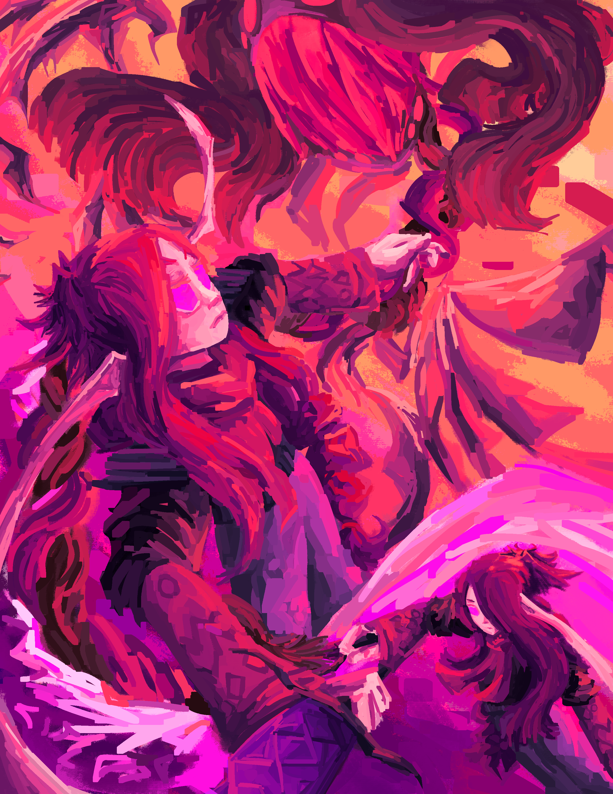
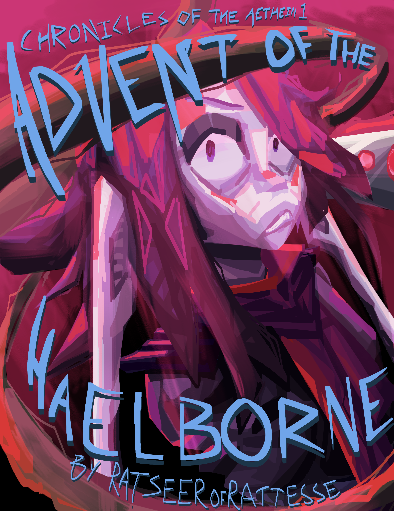

# Misc

Miscellaneous art pieces.

### ODODI Logos

???+ info

    :octicons-unverified-16: :material-crop-landscape: :material-check-all:
    
    For reference on what these symbols mean, see the [art index](../index.md)

### Cover Art

???+ info

    :octicons-unverified-16: :material-crop-landscape: :material-check-all:
    
    For reference on what these symbols mean, see the [art index](../index.md)

### Cover Art textless

???+ info

    :octicons-unverified-16: :material-crop-landscape: :material-check-all:
    
    For reference on what these symbols mean, see the [art index](../index.md)

### Old Cover Art

???+ info

    :octicons-unverified-16: :material-crop-landscape: :material-trash-16:
    
    For reference on what these symbols mean, see the [art index](../index.md)

### Banner

???+ info

    :material-star-four-points-outline: :material-crop-landscape: :material-check-all:
    
    For reference on what these symbols mean, see the [art index](../index.md)

### Another banner

???+ info

    :material-star-four-points-outline: :material-crop-landscape: :material-check-all:
    
    For reference on what these symbols mean, see the [art index](../index.md)

