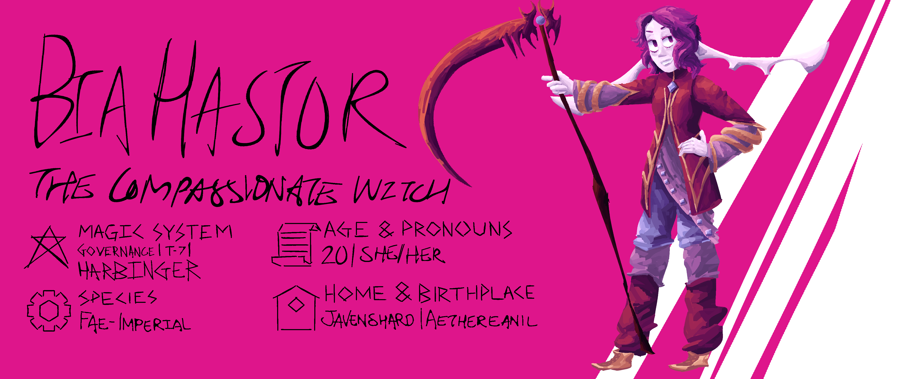

--- 

Occupation: Adventurer

Specialization: Sanguine + Imperial + Doom + Reality → [Harbinger]

Abilities: Fel Scythe, Sanguine Blades, Sanguine Retribution, Dash

Aliases: Bia

---

Bia is any party's comedic backbone; she will never stop laughing. Get past her big frontal personality however, and she's quite approachable. Never suspicious of anyone or anything, Bia has a high EQ and a detrimental lack of distrust and worry. However, she has been more agitated than usual as of late - it's about time she and her sister sought harder challenges in order to ascend to t-eight, but Ari won't budge out of her comfortable cot in Javenshard. So when Ari comes home ravaged by a hungry overranked demon, Bia convinces her to head to the nearest high-ranked city to request help. Ari quickly finds the trip spiralling out of control when Bia invites not only fellow adventurer Lloyd, but also their noncombatant friends.

Desperate to do something different for once, Bia takes to the journey with enthusiasm, but quickly finds it more than she bargained for as the demon in question turns out to be just as enthusiastic in its pursuit of Ari. Burdened by the guilt of leading her friends into a dangerous and very much preventable situation, she's determined to turn it around and make something positive out of it.