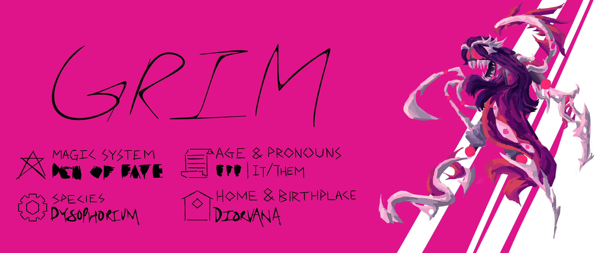

--- 

Occupation: Piston of Change

Aliases: Demon, The Devil, You Antitrinitian Dog, ‘Ah, holy shit, what the fuck is that?! Oh god, it’s getting closer, I can see reality peeling away like sloughing skin, I can feel the cold press of an endless void just beyond our own existence. It speaks to me in rhymes – we are all already in it’s grasp.’

--- 

Professional mass murderer Grim is always on the lookout for a new challenge, and they've found their newest target suitably entertaining. Aryon Hastor has the power to probably kill Grim - yet would probably kill herself in the process. Delightfully taunting. Grim and the rest of the dysphorium don't seem to care for much but endless blood and death - suffering builds character, after all. The Engine of Change wants good character arcs, so Grim wants good character arcs, and gets that done the only way it knows how. Just don't mess up their pronouns.