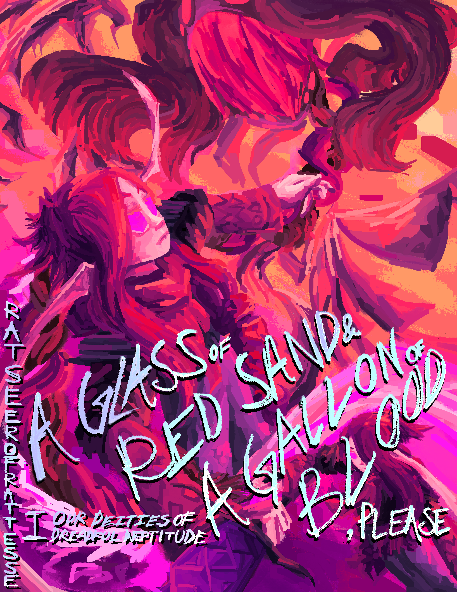

???+ tip

    Comic updates will be pretty darn slow.

    Also, the prologue chapter cover is WIP.

    This comic isn't debuted yet! It's just public because I can't knit the new chapter system in without this. Sorry!

???+ tip
    What's the point of this? Don't you already have a book?

    Yeah, but this is kinda for my art practice, not for storytelling. For the sake of getting shit done, the novel edition of ODODI is for the story, and this is just for me to practice perspective and backgrounds and stuff, and also to satisfy my urge of animating this entire thing which isn't possible. You're supposed to read the book version and this is bonus content.

-   :material-book:{ .lg .middle } __Back__

    ---

    [:octicons-arrow-left-24: Mainline Story](../index.md)

-   :material-book:{ .lg .middle } __Next__

    ---

    [:octicons-arrow-right-24: Prologue: Eating New People](PCover.md)

