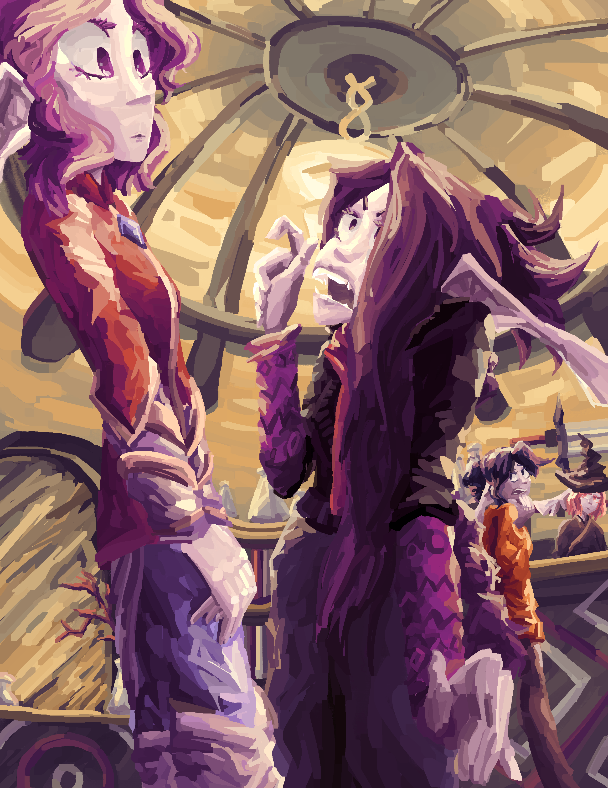

{width="512"}

<h2 style="text-align:center;">Chapter III:</h2>
<h1 style="text-align:center;">[Crab Rider]</h1>

<em>big crab</em>

???+ warning

    Chapter illustrations currently WIP.

“Those are not horses.”

Bia had apparently bought a bunch of crabs. Not a van, not a car, not even a horse. Three six foot tall crabs standing in the street outside the inn, each fitted with a saddle.

???+ governance "Creature: [Hexacampus] (Crustacean)"

    Average Tier: V

    Summary:

    A large crab creature, usually four or five feet tall. Its legs make up most of that height, as they are nearly vertical when standing. They shuffle like all crabs, but are able to do so at extreme speed, rivalling that of a traditional motorized vehicle. Because of this, fae use them as mounts, but they are rarely seen due to how hard to tame they are.

“Bia,” I said, annoyed. “Why in the seven hells did you buy hexacampi? How expensive was this?!”

“Cars and horses are just so default y’know?” She drawled, leading one to kneel low enough to step on. “Now, six gigantic ass-kicking megacrabs? Just really frickin’ sick.”

“Interesting statement,” Dan said. He was still standing in the doorway, writing away on his notepad. Not even gigacrabs could shock away his stoicism. Rosa was already next to one of the hexacampi, rapidly flitting around it as she inspected the creature.

“I have some… concerns,” She said. “The practicality of riding creatures that walk sideways, for example.”

Lloyd raised a finger. “Faevinity have been employing hexacampi as mounts since the Miruen Empire. Though not commonly seen in Eorwin – “

“Shp-shp-shp,” Bia rolled her eyes. “Lloyd, just one sentence is enough. Look: These things are fast – and definitely sensible in the evolutionary landscape. Not that hard! I could even have cut off that part about the evolutionary landscape, but that adds a nice little tidbit of comedy.”

“What...?” I comprehended her words with confusion.

Bia mounted one of the crabs and tapped its shell, which sent it rocketing off as she grabbed the straps attached to the saddle.

“Anyway, I had these for quite a while already. Trained em myself too,” She guided the hexacampus off down the street, past the inn’s garden and then circled back around.

“That’s fuckin’ sick,” Rosa exclaimed, eyes wide.

“I know right?!” Bia exclaimed back.

“I could run faster than one of those,” I scoffed, rolling my eyes. “Dan?”

I look up and spot Dan already on a hexacampus as it waddled off at a leisurely pace. He was still writing in the notebook, having ignored our bickering.

“Should’ve expected that,” I muttered, then moved towards one of the crabs. It snapped a pincer at me, so I conjured a knife and swiped back.

“Easy with the crabs!” Bia called. “They were actually pretty expensive. But we’re rich! But also, they were expensive.”

I glared at her, then the crab. The hexacampus eventually decided to kneel down, so I stepped on – though still with some difficulty. Four foot tall. Lloyd did the same with his.

Rosa hopped right up onto hers, which promptly zoomed off at a speed expected of a tier five creature. It whirled off down the street, Rosa screaming on its back.

“BIA! I thought you trained these!”

“Uh, yep, I did,” Bia said shiftily. “Jobber must be a bit excited.”

I turned to look at her incredulously as Rosa continued.

“How long ago exactly did you buy these?”

“A week! I got em from this guy I met at the inn.”

“We’re supposed to depend on massive crabs that you bought off a random guy in Dan’s inn, which you only trained for a week. Oh yeah, and they’re also the size of a car and have gigantic pincers.”

“Relax! It’s fine. I have a way with animals. I think.”

I looked pointedly at the rapidly re-approaching dot that was Rosa and the crab.

“Of course.”

“Ehehe. I told him to do that,” Bia whispered to me. I sighed.

“Rosa!” I called, ignoring Bia’s protests. “You should tell Bia to fuck off!”

“Why?!” She yelled back.

Rosalith Verosaven’s motivations were many and complex to appeal to. Knowing thus,  I said: “It’ll be funny!”

“HEY BIA! FUCK YOU!”

Eventually, we managed to get ‘Jobber’ under control, and we set off to leave Javenshard. There wasn’t a lot of luggage, as everything was carried in dimensional bags. Those things are absolute lifesavers. Even so, they had taken quite a hunk out of our funds back when Bia and I bought them for the business. In the words of Bia, they were expensive. But also, we’re rich! But also, they’re expensive.

We rode out past the inn and towards the town’s walls. Towns here in the north of the Haequar province either built walls or made delicious meals for the monsters. The adventurers here may be able to mitigate that a little, but Javenshard was small enough that everyone pretty much knew everyone. Except for myself, of course. Yes, I had the great privilege of social skills, I just didn’t bother to use them. The point: town’s too small to warrant regular patrolling.

Adventurers weren’t very common there. There were only three or four resident besides Bia and myself. Oh, and Lloyd, but he wasn’t local. Based on what I’d seen of their fights, the locals’ skills were… severely lacking. Even just Bia was an entirely different paradigm compared to them, and that’s saying a lot. To myself, they were children.

Rosalie was fuming with Bia after the incident with ‘Jobber’. They were still trading increasingly nonsensical insults up ahead. Dan had joined in, not taking sides but simply overanalyzing every word of their conversation. I was sat on a hexacampus, riding next to Lloyd.

“So,” he said. “Are you alright?”

“What?” I said, surprised. “What d’you mean?”

“You look gloomy. Someone kill the cat?”

“Lloyd, what are you on about? Everything’s fine.”

“I don’t think it’s fine, Ari,” Lloyd said inquisitively. “Didn’t you like… half die yesterday?”

“It’s fine. You know the risks, Lloyd, you’re an adventurer too. We half die all the time.”

“That doesn’t mean it doesn’t suck.”

“Look, I’m fine,” I gestured, exasperated. “I got stabbed, I healed back up. The stabber was a little weird, but I’m fine. Stop worrying!”

“Okay, okay. I was just checking. Because, like, Bia’s kind of silly, and Rosa takes after her. And Dan is just weird. They don’t make the best support.”

“Bia is very silly,” I looked at the road, cutting through the forest. Bia, Rosa, and Dan were still chattering up ahead. “Well, thanks for giving a shit, but I don’t need it. You worry about yourself, won’t you? Not like you to be late.”

He stiffened a second, to which I would’ve raised eyebrow but it was gone as it came. I didn’t exactly sleep well. “I was a little busy, talking with some friends.”

“From Deliria?” I asked. “I haven’t seen you with anyone around here.”

“Oh, not local, but not Delirians either. I parted ways with Deliria quite vehemently.”

“Sounds like a story,” I grinned.

“Later,” He said. “You’re grinning, that’s new. Cat’s revived?”

“This is a dumb analogy.”

“Ari, Ari. Alright, then,” He laughed. “Well, did you get anything valuable out of yesterday’s haul?”

“Um, I don’t know. Wait… yeah, Bia looted a crienbeast and got a Governance core. Sick, right?”

“Really?” Lloyd’s eyes went wide. “I’ve been adventuring two years and I haven’t seen a single one.”

“Hell yeah!” I pumped a fist. “We’ll probably sell it when we get to Evedast. I would have done it this morning, or when we get to Roriodo later, but there aren’t many people with the money nor use for such a thing.”

“And you do?”

“I’m rich. Adventuring pays great when you know what you’re doing. But I’m not much of a ritualist, no. Nor an artificer. I mean, I could probably make something with it – ”

“So you’re saying you don’t.”

“Welllllll I wouldn’t say that. I’m just, specialized in other things.”

Lloyd chuckled. “Right. Such as?”

“Killing, and more killing.”

“How diverse. I can at least do artifice.”

“But I can do that too!”

“Oh, really? What’s the best thing you’ve made?”

“Um, I don’t know,” I shrugged. “Lemme look through my bag.”

I swung the dimensional backpack onto my lap, reaching my arm in. Most high quality dimensional bags had a function that gave users an instinctual sense of whatever was inside. No idea how it worked - I’m not a ritualist. It was probably some sort of instrument that interfaced with the user’s aura. Actually, why am I considering this when these things can fit a whole ass banquet table into a space the size of a fist?

Whatever. Anyway, I searched the bag for something cool. I’d seen Lloyd’s work – he made lots of magic items. Magic darts, potion belts, even some cool little knives I’d seen him engraving ritual circles onto. I’d have to match his standard.

I shuffled through the various objects. A potion, another potion, and a lot more potions. I hadn’t really made anything except potions. Then I sensed it – the puppet.

It was a white rabbit puppet, with no eyes, a massive open mouth, and a bow tie.

???+ governance "Item: [Rabbit Puppet] (Puppet)"

    Tier: 0

    Made by: Aryon Hastor

    *I don’t fucking know it’s a rabbit puppet.*

I didn’t remember making it, but it had my name on it. The Governance didn’t lie – I must’ve forgotten it. The puppet was simple, but it was also very high quality. It would do.

“Aha!” I said triumphantly, pulling the puppet out and dangling it from my finger.

“Is that… a rabbit?”

“I have no idea, but it has my name on it and it looks cool.”

I handed him the puppet, and he turned it over, inspecting it.

“Well, it’s not half bad.”

“Correct.”

“It’s fully bad.”

I shot him a flat look.

The crabs moved efficiently under Bia’s direction – a miracle, as Bia never did anything efficiently. After three hours of tireless riding, the walls of Roriodo came into view. Grand stone walls - which were, in reality, fraud. If a monster wanted in, they got in. They were just deterred from wanting it.

We passed through the gates, which had extra rituals on them cos they were extra flimsy. Inside, Roriodo was much like Javenshard. Settlements here often grew into series of rings, as a function of the Governance. The Governance made a point of infiltrating each and every aspect of fae life, and the building of settlements was just one of the many areas it helped facilitate.

I’d only been here once before, having crossed through it when Bia and I originally came to Javenshard years ago. The monsters were marginally higher rank back north, so I saw no point backtracking. Bia, however, did.

“Afternoon, Dahr!” Bia called from the back of her hexacampus as we passed by a man with a straw hat. He was digging through a coat with so many pockets it was more negative space than matter.

“Bia! Good to see ya,” Dahr raised a fishing pole from the rack next to him in greeting. “I see ye got yer dirty rich hands on a crabbo. What I wouldn’t give to fish up one of those things! Except, of course, a hefty sum of cash to one.”

“Of course, of course,” Bia laughed as we rode away. “Hope your next catch goes good!”

Dahr raised a hand in farewell, then returned to digging through his coat.

I steered my hexacampus towards Bia’s.

“You know this guy?”

“Oh, I know everyone here,” she replied.

“Everyone,” I repeated incredulously.

“Look, it’s not a bad thing to have a social life. Try it out sometime.”

Bia wasn’t lying when she said she knew everyone in Roriodo. I could swear that she greeted literally every civilian we passed by. And I use the term civilian specifically – there were definitely no adventurers here. Or at least, no adventurer worth paying attention to. I could probably decimate this whole town in a week! With Bia and Lloyd – fuck it, a day, tops. Adventurers as skilled as us are rare ‘round the northen end of Haelcrien.

Eventually, Bia brought us to the stables that she used when she’d come around Roriodo in the past (she rented a horse sometimes). They didn’t usually receive hexacampi, but Bia’s bullshitting, charisma, and mysterious goodwill with Roriodoans convinced em to deal with our rides. With those taken care of, we started looking for somewhere to stay the night.

“So, what’s it like here in these other northern towns?” Rosa asked me giddily.

“Ask Bia instead,” Dan said in his usual I-am-very-bored-and-therefore-cool tone. “Ari doesn’t leave Javenshard. She has no social life.”

“Why does everyone keep saying that?” I spun around, braid twirling. I had done the remainder of it up again after the tree decimated it.

“Because it’s true?” chimed Lloyd.

“That’s one know-it-all comment I can stomach!” Rosa said. Lloyd pumped his fist. “Okay, Ari, you’re boring.” She zipped to Bia’s side with speed that didn’t befit a tierless fae.

“So, Bia, what’s it like in the other northern towns?”

“Oh, it’s fucking weird,” Bia said. “And I like it that way. These non-Ari, happy and fun civilian types are really quite pleasant to be around and do indeed have a social life…”

I shook my head and walked along, panning my eyes over the street. The town was composed mostly from stone-walled cabins with wooden roofs, as was standard this far north and this far from true civilization. A rare few metal-scaffolding buildings were scattered around the town’s central square, but other than that, it was quite quaint.

“Ohhh yeah!” Bia spouted suddenly. “Rosa, Dan. We should get you some adventuring gear.”

Dan frowned.

“Ooooh yes,” Rosa answered with matching enthusiasm. “Definitely. Must have. Fighting monsters? Cool as all hells.”

“Oh come on,” I said. “We can’t get you shit here. Roridio is not an adventuring town and I will not have my idiots going around in discount gear.”

“Don’t worry,” came Bia. “I know a guy.”

“You seem to know a lot of people here.”

“I have a social —“

***

Bia guided us to a box that was the picture of theatrically pretentious impure hermetic-cabin-in-the-woods-ness. Logs were stacked atop one another for the logs — but it was blatantly just a facade over some smooth and insulated wood and metal. The other, more obvious facade was the sloped roof, which was in fact just a flat decorative piece stood up on the roof of the building. It was like the building was trying harder to look fake than to actually hide behind its various pretenses.

What I mean to say is, it looked suspicious as hell.

Bia proceeded to barge her way in like an overconfident protagonist blissfully unaware of their various financial deficits. The wooded plank doors declined. I marched up next to her and pushed the doors to either side. They were sliding doors — I know my shady businesses.

“Oh bloody hells,” Bia muttered as I continued in. “Really?!”

“Haven’t you been here before?” Lloyd asked her.

“Yeah, but Noka keeps changing shit up. Marketing maybe. Why in Ayueso’s name does anyone use sliding doors?! They’re so goddamned inelegant.”

“Ayueso would not like scum uttering her name, I’d wager,” I drawled in monotone, walking up to a bench placed at the side of the room. I sat down and gazed expectantly at the door like a disappointed mother. “Also, the Trinity doesn’t exist. Basic firmament theory proved that two decades ago and we’re still dealing with damned Stagnants.”

“You say hells all the time,” Bia complained.

“The hells are cool, and — “

“Well actually, they’re a purely metaphysical space in which heat does not exist.”

“Shut the fuck up.”

The other three filed in as Bia walked up to the counter and rang a bell. We waited awkwardly until a tall woman in a discount sorceress outfit stumbled into view.

“Bia!” she said in cheerful greeting, trying too hard to fake an old woman’s voice.

“Hello, Noka,” Bia replied in the squeakiest tone she could muster. “Have you any burgers?”

They both burst out laughing.

“You do realize making inside jokes in front of people who don’t know them just makes you look crazy?” I asked.

“I am crazy!” Bia replied with a giggle.

“For burgers,” Noka added delightfully.

“Oh for fuck’s sake,” I sighed, pushing Bia away as she fell into a laughing fit. “Morning – Noka, was it? We’re here to get a pair of zeroes some adventuring gear. Loath as I am to believe in anything Bia recommends, the adventuring industry here sucks ass and you’re the only place we could find. As team leader –”

“Excuse me?” Rosa interjected. “Whoever said – “

“Me. We wouldn’t be out here if I hadn’t gotten mauled by a malicious fleshy cheese grater. As team leader –”

“As team leader,” Bia cut in joyously. “My job is to ensure my people’s safety –”

“And I demand a sample of your wares,” I cut back in, glaring at Bia. She had an odd ability to predict exactly what someone was about to say. Lloyd laughed.

“Oh, I assure you my wares are perfectly up to standard,” Noka said, leaning over the desk with a leering grin. I stared back with half-lids.

She unlocked the gate into the backroom and stepped in with a waving gesture. We followed through the door into a storage room the size of a walk-in closet. There was no equipment here; just piles of leather that I guessed to be dimensional bags. Noka poised to begin looking for something – then turned back around.

“Say, what archetype you going for?”

“Say what?” Rosa asked.

“She means,” I answered. “If you want to be a mage or warrior or seven foot tall globular mass or whatever the fuck.”

“What’s the coolest one?”

“Me. High skill high damage and zero margin of error.”

“Scout archetypes are pretty fun too,” Lloyd said.

“Lloyd, you’ve only ever tried that archetype.”

“And you –”

“My adventuring journey was a long succession of formulative experiences of emotional depth –”

“Fuck you Ari, you’re boring,” Bia jumped in. “As a support spellcaster with suspiciously offensive blood powers, I can assure you that my specialization –”

“Has a cool factor based entirely off eye candy and zero effectiveness.”

“Bullshit!”

“Look Bia, you barely ever contribute –”

“Hi,” said Rosa, holding up a green cloak and some light-looking fabric garments, lined with silver decor. “Can y’all shut up? I picked something.”

“Let me inspect it,” Bia said.

“No NO, you have no expertise in this field. I literally had to buy you your own gear because you went to the wrong goddamn side of the city and instead of heading back got drunk in some shitstand bar all fucking day at twelve fucking noon –”

“Woah, woah, woah!” Bia exclaimed, arms wide. “I have, no IDEA! what you are talking about!”

Dan wheezed in the background.

“You’ll have to tell us that story sometime,” Lloyd grinned.

“Whatev,” I reached out for the green garment and gave it a tap.

???+ governance "Item: [Huntsman Set No. 12] (Outfit)"

    Tier: 0

    Made by: Noka Aquiesce

    *Another hunter’s garb. Probably could have done better on the deco, but I’m a craftsman, not an artist. Sue me.*

    Damage Reduction

    - Moderate

    - Specialization:

        - Piercing

    Enchantments:

    - Self-Repair

    - Reinforcement

???+ governance "Enchantment: [Self-Repair] (Repair)"

    Effects:

    Equipment self repairs. If overly damaged, may not be able to recover.

???+ governance "Enchantment: [Reinforcement] (Reinforcement)"

    Effects:

    Enhances equipment durability and protectiveness.

“Told you scouts were cool,” Lloyd nudged Bia in my peripherals.

“Light clothing doesn’t make you a scout!” Bia shout-whispered.

“Oh that’s actually…” I looked back at Noka, who grinned irritably. “The hell are you doing in a dingy hole like this?”

“I’m rich and like making shit,” she replied. “I also hate dealing with the general public, so I only take customers Bia brings over. Which turns out to be a lot more than I expected on account of her having a social life.”

This comment prompted narrowed eyes to Bia. She smiled innocently.

“Valid lifestyle then,” I approved, then turned to Rosalith. “Archery, aye? I recall your aim was never the best w hen we played warball.”

“Practice makes perfect!” she replied matter-of-factly.

“Procrastination makes perfect,” Bia said.

“Perfection is a fictional construct, ” said Lloyd.

“Philosophers thou art not,” I sighed. “Rosa, I’m assuming you actually have the money for this.”

“Oh wait, money exists,” Rosa said in tongue of poor. “Noka, how much?”

Suffice to say she blanched at the number.

“And Dan – ”

“Way ahead of you mate,” Dan stuffed an armoured-something into a dimensional bag. Two blades with inset green gems lay against the wall next to him.

“How the hell did you –”

“Did you four not notice that I contributed zero dialogue to your threeway pissing contest? Rosa, I’ll cover your costs. You’re making dinner for a week the next we get back though.”

“Well that’s nice of you,” Bia sounded surprised.

“Why d’you sound surprised?” Dan raised an eyebrow.

Rosa raised a finger, then put it down with a sigh.

***

We found a place to stay the night – which wasn’t very hard with how many times Bia’s been here. She’s probably got a bajillion discounts on every hotel in the town.

Dinner’s been had and I’m not describing the chaotic mess that was – the others are still down there screaming at each other. I’m up in mine and Bia’s room painting, pulling from memory. Tier seven lets me do that without getting a headache, and these dimensional bags let me fit all the easels I need.

“So,” Lloyd says from the couch, putting down his book. “Where else are we stopping before Troltano?”

I put down another brushstroke against a tall alpine trunk.

“Another little town called Evedast. I think that’s about it. Can’t wait to get out of here so Bia can stop obnoxiously knowing every single little thing about – everything.”

Lloyd laughed.

“Yeah, she’s real annoying sometimes. Funny though.”

“Never admit that in my company, Lloyd.”

“Of course.”

…

I turned back to the painting and crossed shadows across the sky.

“So what’re ya painting?”

“Javen Woods.”

“Do you paint anything else?”

Now that I think of it, not really.

“I painted the street some times.”

“What about, people?”

I cocked an eyebrow. A dark silhouette appears left-bottom canvas.

“Not often, and always from the back. People are weird. Good to sketch, but I don’t like painting them. Too many planes on the face. Weird topography and I can never get it right.”

“I see. Maybe try that sometime?”

“And who would I paint?”

“People you spend a lot of time with, I’d guess. Or yourself, that’d look pretty good.”

“I’m not putting up a painting of myself on my bedroom wall. It would look narcissistic.”

I glared a splotch on the canvas that would not look right whichever way I painted over it.

“Artists make self-portraits all the time.”

“And where’d ya hear that? You took art in school?”

“No no, I didn’t.”

“Actually, where did you learn to fight?” I asked, now aggressively stabbing the paint blob. “It certainly wasn’t in these backwaters.”

“My family actually comes from the Delirian Isles. We’re scholars, by tradition, but I wanted something a little different. I had a… falling out with them.”

“What happened?” I inquired.

“They didn’t like where my life was going,” he shrugged. “Assholes. I still keep in touch with my cousin Ramuj though. He’s a cool guy. Does work for the Eden Repository in Edenthein.”

“Nice,” I said, having run out of things to discuss. Holding a conversation was not one of my best skills.

There was silence for a while. I seethed one last time at that splotch before starting to take down the easel.

“I should probably go to sleep now,” I said. “Tier seven or not, rest is important – they always drove that home back in the big city.”

“Big city?” Lloyd asked.

“Where we immigrated from. Parents never bothered telling me and I took enough of a hint not to ask.”

“Odd.”

“I’m going to sleep now. You should probably go too.”

“Yeah, okay. See you tomorrow, yeah?”

“No shit, where else would we be?”

-   :material-book:{ .lg .middle } __Previous__

    ---

    [:octicons-arrow-left-24: Chapter II: Vacation...?](CH2.md)

-   :material-book:{ .lg .middle } __Next__

    ---

    [:octicons-arrow-right-24: Chapter IV: You Can Call Me...](CH4.md)

